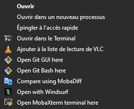

# 🚀 Windows Context Menu Customizer

Easily add Windsurf applications to the Windows context menu.

## ✨ Features

- 📁 Integration into the context menu of folders
- 📄 Support for individual files
- 🖥️ Compatible with right-clicking on the background of a window
- 🔒 Auto-execution in administrator mode

## 🛠️ Installation

1. Download the script "open-with-windsurf.ps1"
2. Run it with PowerShell as an administrator
3. That's it!

## 📜 License

MIT

## 🤝 Contribution

Contributions are welcome!
